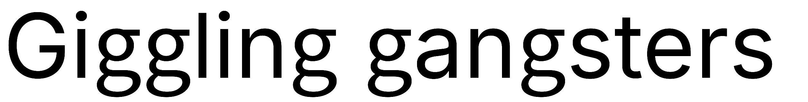
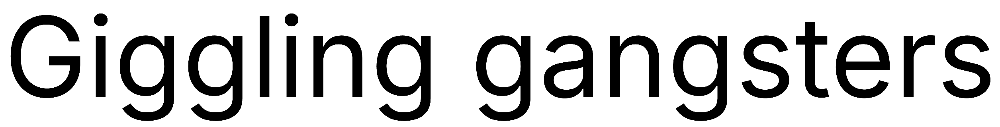
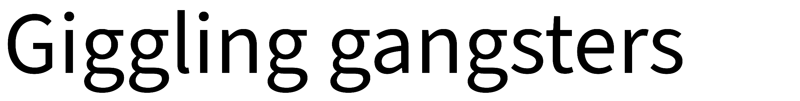

# Lab3 Sans font
The idea is simple: Inter is extremely versatile variable font with lots of configuration opportunities (rivaled only by few modern developments like Roboto Flex).
It is widely used, and to step away slightly from the crowd - double-storey g might be used.
Double-storey g is transplanted from Source Sans 3, with corrected scaling and spacing.
Only Roman variant is transplanted. Italic is single-storey, and supposed to be closer to handwriting, therefore one should use regular Inter font for Italic.

Stroke width of Source Sans 3 is incompatible for Light and ExtraLight weights, so these are omitted.

This should be considered a live demo until (eventually and hopefully) Inter implements double-storey g variation. 
Relevant feature request link: https://github.com/rsms/inter/issues/539

# Quick comparison
**Lab3 Sans:**


**Inter:**


**Source Sans 3**



# Credits & license
- 99.99% of work here done by The Inter Project Authors (https://github.com/rsms/inter) who developed the base font.
- g glyph is from Adobe font Source Sans 3 (https://fonts.adobe.com/fonts/source-sans-3).

License is SIL OPEN FONT LICENSE Version 1.1 

# Demo
https://barsmonster.github.io/Lab3-Sans/lab3_demo.html

# For testing you can use files via GitHub Pages CDN:
```
  @font-face {
      font-family: 'Lab3 Sans';
      src: url('https://barsmonster.github.io/Lab3-Sans/fonts/Lab3Sans-Regular.woff2') format('woff2'),
           url('https://barsmonster.github.io/Lab3-Sans/fonts/Lab3Sans-Regular.ttf') format('truetype');
      font-weight: 400;
  }
  @font-face {
      font-family: 'Lab3 Sans';
      src: url('https://barsmonster.github.io/Lab3-Sans/fonts/Lab3Sans-Medium.woff2') format('woff2'),
           url('https://barsmonster.github.io/Lab3-Sans/fonts/Lab3Sans-Medium.ttf') format('truetype');
      font-weight: 500;
  }
  @font-face {
      font-family: 'Lab3 Sans';
      src: url('https://barsmonster.github.io/Lab3-Sans/fonts/Lab3Sans-SemiBold.woff2') format('woff2'),
           url('https://barsmonster.github.io/Lab3-Sans/fonts/Lab3Sans-SemiBold.ttf') format('truetype');
      font-weight: 600;
  }
  @font-face {
      font-family: 'Lab3 Sans';
      src: url('https://barsmonster.github.io/Lab3-Sans/fonts/Lab3Sans-Bold.woff2') format('woff2'),
           url('https://barsmonster.github.io/Lab3-Sans/fonts/Lab3Sans-Bold.ttf') format('truetype');
      font-weight: 700;
  }
  @font-face {
      font-family: 'Lab3 Sans';
      src: url('https://barsmonster.github.io/Lab3-Sans/fonts/Lab3Sans-Black.woff2') format('woff2'),
           url('https://barsmonster.github.io/Lab3-Sans/fonts/Lab3Sans-Black.ttf') format('truetype');
      font-weight: 900;
  }
```
